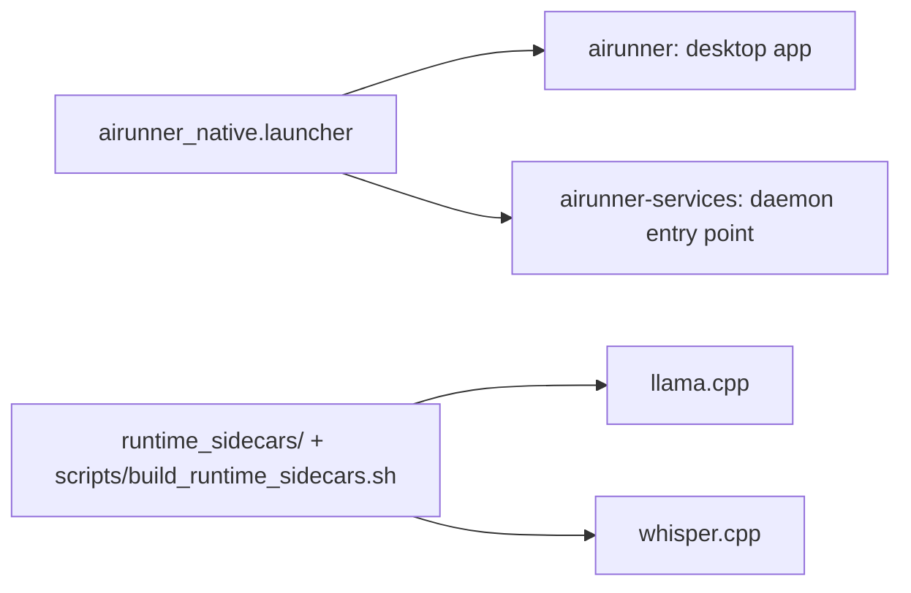

# airunner-native

The launcher entry point, crash handler, and pinned native runtime
sidecar (`llama.cpp` / `whisper.cpp`) build tooling for
[Capsize-Games/airunner](https://github.com/Capsize-Games/airunner)
(AI Runner). Extracted into its own repository (issue
[#2196](https://github.com/Capsize-Games/airunner/issues/2196), part of
the repository-split tracker
[#2185](https://github.com/Capsize-Games/airunner/issues/2185)) because
its release cadence is not Python's: the sidecar build changes when a
pinned native runtime changes, rarely and for reasons unrelated to
application code, and needs `cmake`/`mingw-w64`/`ninja` rather than a
Python packaging toolchain.

AIRunner itself is a pure Python application -- there is no compiled
C++ launcher and no bundle/installer packaging. The desktop app runs
directly from installed Python packages; this package provides the
`airunner-native` command that starts that process (GUI or headless)
and the crash capture that wraps it.



## What this package owns

- The `airunner-native` launcher entry point (`airunner_native.launcher`).
  The GUI package owns the primary `airunner` command; installing
  `airunner-native` doesn't shadow or duplicate it.
- The native-launcher crash handler (`airunner_native.crash_handler`),
  distinct from `airunner`'s own GUI-specific crash handler -- these
  are two legitimate implementations for two different processes, not
  a duplicate.
- Repo/runtime layout helpers (`airunner_native.repo_paths`).
- Pinned `llama.cpp` and `whisper.cpp` sidecar build tooling
  (`runtime_sidecars/`, `scripts/build_runtime_sidecars.sh`), built for
  a `linux`/`windows` matrix and published as GitHub Release assets by
  this repository's own `.github/workflows/native-runtime-sidecars.yml`.

## Dependencies

This package's only hard install-time dependency is `airunner-common`
-- every import of `airunner` or `airunner-services` in
`launcher.py` is function-scoped, deferred until the launcher actually
runs, not required merely to install or import this package. Two
extras cover how it's actually used together with the rest of the
application:

```bash
pip install "airunner-native[gui]"      # desktop role: pulls in airunner
pip install "airunner-native[services]" # daemon role: pulls in airunner-services
```

## Runtime sidecars

The pins in `runtime_sidecars/runtime_pins.env` are exact upstream
commits, so bundled runtime binaries don't drift with `llama.cpp` /
`whisper.cpp`'s own `master` branches. Build them locally with:

```bash
./scripts/build_runtime_sidecars.sh --target-platform linux
```

CI builds both matrix targets on every release published in this
repository and attaches the resulting bundles as release assets. The
source application's own release pipeline downloads a pinned release
from here rather than building sidecars itself -- see that
repository's `.github/native-sidecar-version` for which tag.

## Provenance

Extracted from `Capsize-Games/airunner` (issue #2196). History for the
moved files is preserved (`git filter-repo`).

## Licensing

GPL-3.0-only, matching the application this launches. See
[`LICENSE`](LICENSE).
